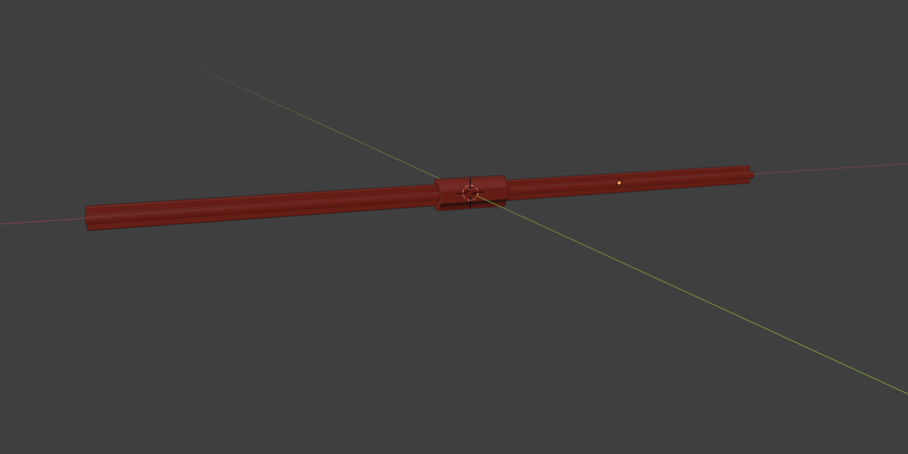

# Axle

## Function

The axle provides a rigid rotational connection between paired gears and ensures synchronized motion between parallel tread assemblies.
It transmits torque generated by the tread system and maintains precise alignment of rotating components under load.

Axles are critical structural and functional elements of the power transmission system.

---

## Quantity

2 pcs per system

- Front axle (drive and synchronization)
- Rear axle (drive, synchronization, and tensioning interface)

---

## Interfaces

- **Gear**
  - Each axle carries a pair of gears mounted in parallel
  - Ensures both left and right tread paths rotate in unison

- **Axle Mounts**
  - Axle is supported by front or rear axle mounts (bearing blocks)
  - Maintains alignment and minimizes friction

- **Frame**
  - Axle position is fixed or guided relative to the frame
  - Defines tread spacing and geometry

- **Pinion / Generator (Front Axle)**
  - Front axle interfaces with the pinion and generator system

---

## Reference Geometry

- Axle length and diameter are implementation-specific
- Prototype versions may use modular axle segments
- Production versions may use continuous shafts optimized for strength and corrosion resistance

---

## LEGO Reference Parts (Prototype)

- [**59443** Technic Axle Joiner](https://library.ldraw.org/parts/10458)
- [**3737** Technic Axle 10](https://library.ldraw.org/parts/6803)

Reference parts are used for prototyping only and do not constrain production geometry.

---

## Operating Role

- Transfers rotational energy from the tread-driven gears
- Maintains synchronized rotation across both tread assemblies
- Provides a stable axis for power extraction and transmission

---

## Design Notes

- Axle stiffness directly affects gear alignment and wear
- Material selection should account for submerged operation
- Rear axle may allow limited axial movement when integrated with a spring-loaded axle mount for tread tensioning

---

## Implementations

- Prototype implementation:
  `models/prototype/parts/axle/`

- Production implementation (v1.0):
  `models/1.0/parts/axle/`

---

## Licensing

This part is provided for non-commercial use under the
Creative Commons Attribution–NonCommercial–ShareAlike 4.0 (CC BY-NC-SA 4.0) license.

Commercial use requires a separate license.
See the repository root `COMMERCIAL.md` for details.
