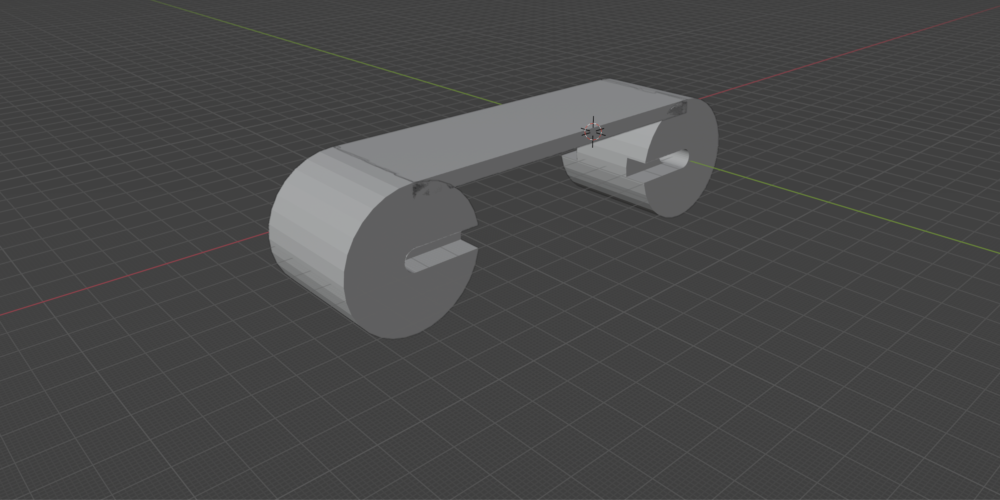

# Hydrodynamic Center Panel

## Function

The hydrodynamic center panel forms the vertical boundary of the water flow channel beneath the blades.
It prevents vertical water escape, directs incoming flow toward the blade capture region, and improves overall energy transfer efficiency.

Together with the side panels, the center panel defines a controlled hydrodynamic channel through the active capture zone.

---

## Quantity

1 pc per system

---

## Interfaces

- **Frame**
  - Center panel is rigidly mounted to the frame
  - Provides structural continuity along the tread path

- **Blades**
  - Blades operate above the center panel
  - Panel isolates the return path from the incoming flow

- **Hydrodynamic Side Panels**
  - Interfaces with both side panels to form a closed channel
  - Ensures consistent channel geometry across the capture region

- **Axles**
  - Panel geometry accommodates axle passages and clearances

---

## Geometry Description

- The center panel follows the cam rail and tread path geometry
- At the **front axle**, the panel forms a full circular enclosure around the axle
- At the **rear axle**, the panel forms a partial enclosure covering approximately one quarter of the axle circumference
- This geometry allows controlled flow guidance while maintaining mechanical clearance

---

## Operating Role

- During the **capture phase**, the center panel directs flow upward into the blade array
- During the **return phase**, it shields the return path from incoming flow, reducing drag and losses

---

## Design Notes

- Fixed geometry reduces moving mass and mechanical complexity
- Panel shape may be refined to optimize flow acceleration and pressure distribution
- Structural stiffness is required to maintain consistent channel dimensions
- Surface finish may influence hydrodynamic performance

---

## Implementations

- Prototype implementation:
  `models/prototype/parts/center_panel/`

- Production implementation (v1.0):
  `models/1.0/parts/center_panel/`

---

## Licensing

This part is provided for non-commercial use under the
Creative Commons Attribution–NonCommercial–ShareAlike 4.0 (CC BY-NC-SA 4.0) license.

Commercial use requires a separate license.
See the repository root `COMMERCIAL.md` for details.
