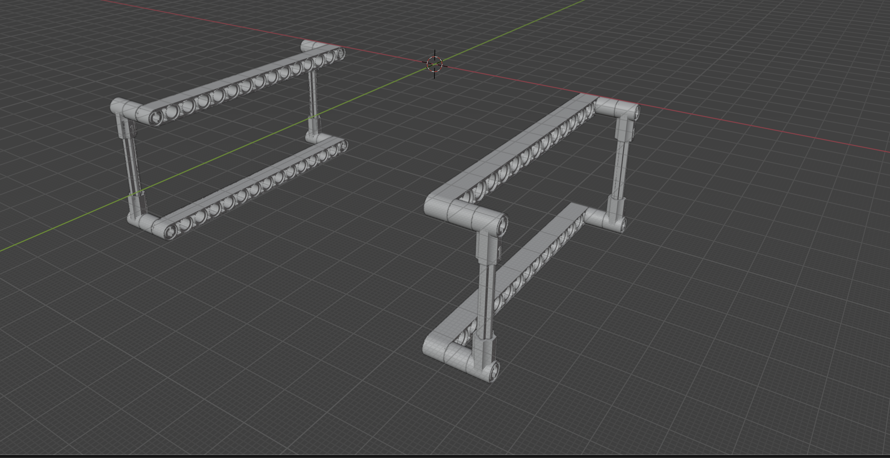

# Frame

## Function

The frame is the primary structural body of the WaterTread system.
It supports all major components, maintains the fixed spatial relationship between subsystems, and provides the structural reference for alignment of the tread assemblies, axles, gears, and hydrodynamic panels.

The frame defines the overall geometry, rigidity, and transportability of the system.

---

## Quantity

1 pc per system

---

## Interfaces

- **Axle Mounts**
  - Front axle mounts are rigidly fixed to the frame
  - Rear axle mounts interface with the frame via spring-loaded mechanisms for tread tensioning

- **Hydrodynamic Panels**
  - Side panels and center panel are mounted directly to the frame
  - Frame provides sealing surfaces and structural support

- **Cam**
  - Cam elements are positioned relative to the frame via the side panels
  - Ensures repeatable blade orientation timing

- **Flow Diverter**
  - Upstream flow-diverting structures are integrated or attached to the frame

---

## Geometry Description

- Frame geometry follows the closed-loop path of the tread system
- Designed to enclose the active capture region while protecting the return path
- Structural members are arranged to minimize flow obstruction while maintaining stiffness

---

## Transport and Deployment

- The frame is dimensioned to fit within a standard ISO shipping container
- Modular construction may allow disassembly or folding for transport
- Containerized sizing enables simplified logistics and deployment

---

## Design Notes

- Frame stiffness is critical for maintaining gear alignment and reducing wear
- Materials should be selected for submerged or partially submerged operation
- Corrosion resistance and fatigue life are key considerations
- Frame geometry may evolve between system versions while maintaining interface consistency

---

## Implementations

- Prototype implementation:
  `models/prototype/parts/frame/`

- Production implementation (v1.0):
  `models/1.0/parts/frame/`

---

## Licensing

This part is provided for non-commercial use under the
Creative Commons Attribution–NonCommercial–ShareAlike 4.0 (CC BY-NC-SA 4.0) license.

Commercial use requires a separate license.
See the repository root `COMMERCIAL.md` for details.
