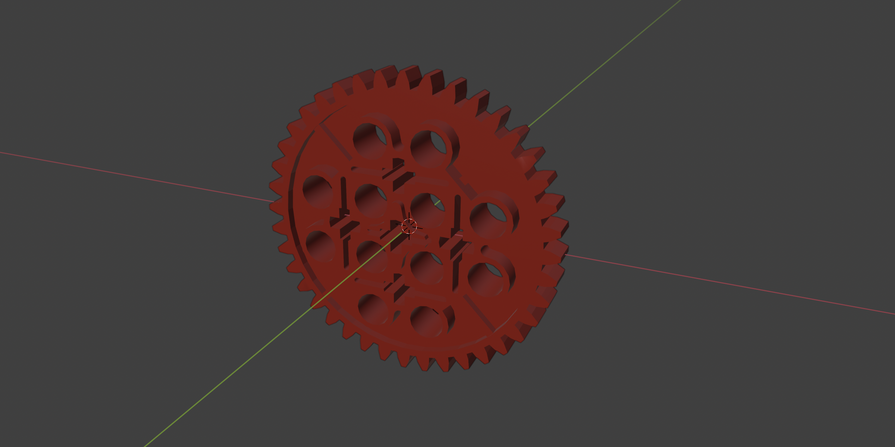

# Gear

## Function

The gear converts linear motion from the tread system into rotational motion and forms the primary mechanical interface between the tread assemblies and the power transmission system.

Gears are used in synchronized pairs at the front and rear of the system to maintain alignment between the left and right tread paths while transmitting torque to the generator via a pinion.

---

## Quantity

4 pcs per system

---

## Interfaces

- **Link Tread**
  - The tread engages directly with the gear teeth
  - Linear tread motion is converted into rotational motion

- **Axle**
  - Each gear pair is mounted on a shared axle
  - Ensures synchronized rotation of parallel tread assemblies

- **Pinion**
  - Gear engages with a smaller pinion to increase rotational speed for the generator

- **Frame and Axle Mounts**
  - Gear alignment is maintained by the axle mounts fixed to the frame

---

## Reference Geometry

- Tooth count and pitch are implementation-specific
- Prototype implementations may use standard LEGO Technic gears
- Production versions may use custom gear geometries optimized for load, efficiency, and hydrodynamic conditions

---

## LEGO Reference Part (Prototype)

- **3649** Technic Gear 40 Tooth

Reference parts are used for prototyping only and do not constrain production geometry.

---

## Modifications (Prototype)

- Remove non-functional through-holes and associated mounting features
- Retain the central axle interface and gear teeth
- Modification reduces unnecessary mass and minimizes hydrodynamic resistance when submerged

---

## Operating Role

- Transfers blade-generated forces from the tread system into rotational motion
- Provides smooth torque delivery to the generator
- Maintains synchronization between front and rear tread paths

---

## Design Notes

- Gear geometry may change between system versions without altering functional role
- Tooth profile, material, and size may be optimized for durability and efficiency
- Submerged operation favors reduced mass and minimized drag

---

## Implementations

- Prototype implementation:
  `models/prototype/parts/gear/`

- Production implementation (v1.0):
  `models/1.0/parts/gear/`

---

## Licensing

This part is provided for non-commercial use under the
Creative Commons Attribution–NonCommercial–ShareAlike 4.0 (CC BY-NC-SA 4.0) license.

Commercial use requires a separate license.
See the repository root `COMMERCIAL.md` for details.
